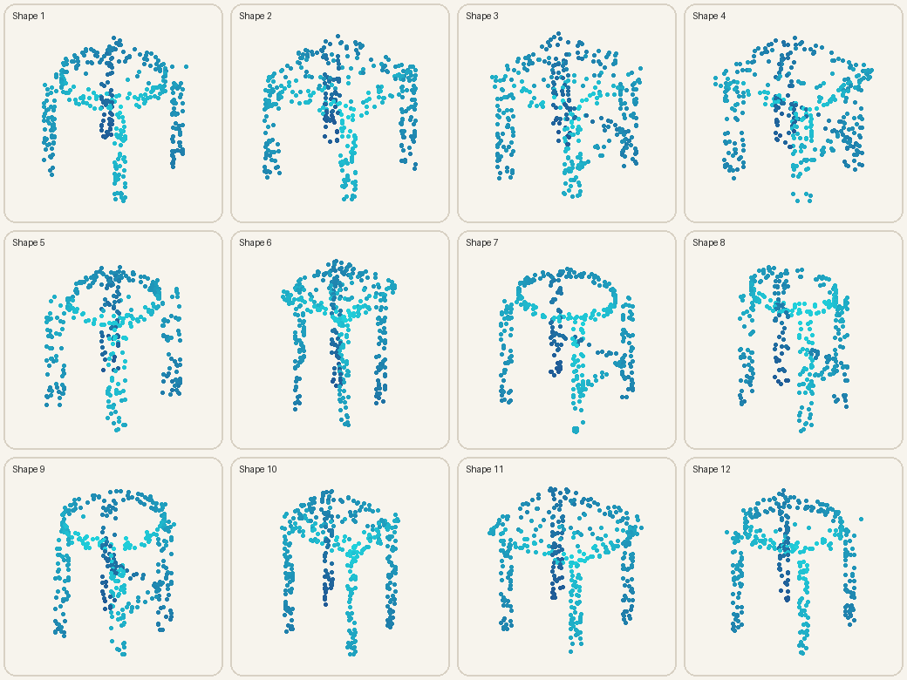
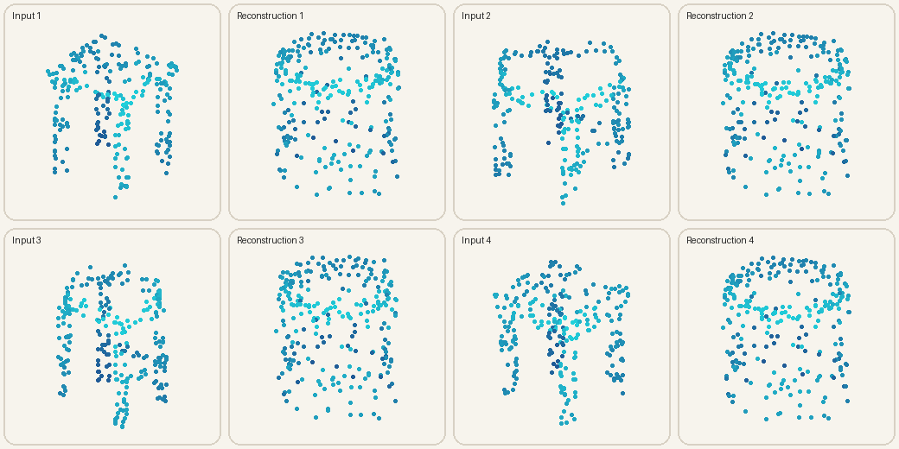
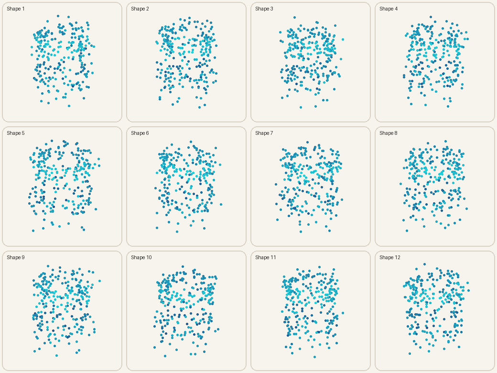
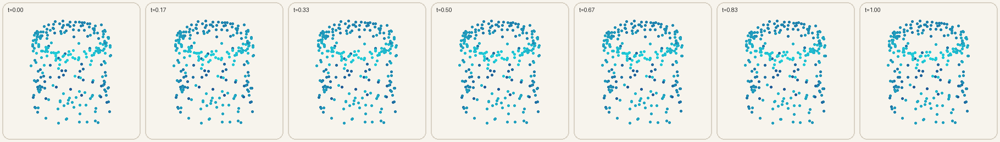
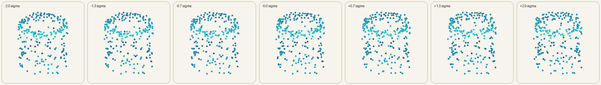

# Learning Procedural 3D Stools as Point Clouds

For this Brown Visual Computing starter project, I wanted to follow one idea all the way from
geometry code to a real generative experiment: **could I write a procedural program that makes
one family of 3D objects, then train a neural network to imitate the distribution without ever
giving it the original parameters?** I chose stools because they are simple enough to generate
from parts, but surprisingly unforgiving—if the seat, legs, or proportions are wrong, the result
stops looking plausible almost immediately.

I built the dataset from scratch, represented each shape as an unordered point cloud, trained a
PointNet-style autoencoder and VAE, and then investigated reconstruction, random generation,
interpolation, latent structure, and the effect of KL regularization. This README contains the
full project outline, process, operating instructions, results, visuals, lessons, and takeaways.

**[Download the visual project writeup (PDF)](output/pdf/BVC_3D_Stool_Generation_Writeup.pdf)**



## Why this project is distinct

This repository does **not** reproduce the reference SDF implementation. It uses a new
object niche (multi-part stools), explicit surface point sampling, a shared PointNet-style
encoder, and a direct point-set decoder. One network generalizes across every shape; there
is no learned embedding table with one code per training object. Saved procedural parameters
are used only for analysis, never as model inputs.

## What I set out to learn

1. Can a point-cloud autoencoder reconstruct a procedurally varied, multi-part object family?
2. What reconstruction cost comes from regularizing the representation into a sampleable VAE?
3. Do latent interpolations remain smooth, and are procedural factors linearly readable?

The broader question I kept coming back to was: **what does it actually mean for a model to
learn a procedural distribution?** A low reconstruction loss is useful, but it does not prove
that random samples are recognizable, varied, or structurally meaningful. That pushed me to
evaluate the model from several angles instead of searching for one perfect metric.

## Final project outline

1. Write a seeded procedural generator for one coherent object family.
2. Sample stool surfaces into fixed-size point clouds and save the hidden parameters.
3. Validate the data, visualize random examples, and create reproducible splits.
4. Train a deterministic autoencoder as a reconstruction baseline.
5. Train a VAE with the same basic capacity and a sampleable Gaussian latent space.
6. Evaluate reconstruction, generation, diversity, novelty, and latent-factor readability.
7. Visualize random samples, held-out reconstructions, interpolation, and latent traversal.
8. Run a controlled three-seed experiment to study the effect of KL weight β.
9. Record mistakes, limitations, and the next experiments I would run.

## Pipeline

```text
interpretable parameters → procedural parts → normalized point cloud
                                              ↓
                            PointNet encoder → latent code
                                              ↓
                               point decoder → reconstruction / new sample
```

Each stool varies in seat width, depth, thickness, height, leg radius and spread, seat
style, and stretcher presence. The dataset includes points, part labels, parameters,
parameter names, and its seed.

### Model design

The encoder applies the same small network to every point and max-pools the resulting features.
That symmetric pooling operation is what makes the representation insensitive to point order.
The decoder maps the global latent code back to an `N × 3` point set. I train it with symmetric
squared Chamfer distance because two identical surfaces can list their points in completely
different orders. The VAE additionally predicts a mean and variance and uses the
reparameterization trick plus a gradually warmed-up KL penalty.

## How the project developed

I approached the project in small checkpoints rather than trying to train a generative model
immediately:

- **Generator first.** I built square and round seats, four cylindrical legs, optional
  stretchers, normalization, part labels, and saved procedural metadata.
- **Data tests next.** One test caught a real bug: integer division sometimes allocated fewer
  points than requested across the four legs. I fixed the remainder explicitly before training.
- **Autoencoder baseline.** This established whether the encoder and decoder could learn the
  geometry at all, without the extra difficulty of a sampling prior.
- **VAE and latent experiments.** I added KL regularization, prior sampling, interpolation, and
  traversal. The first eight-epoch run worked end to end but produced overly coarse samples.
- **Evaluation correction.** My first latent probe reported R² = 1.0, which looked exciting but
  was wrong: there were fewer evaluation examples than latent dimensions. I replaced it with a
  regularized 70/30 held-out ridge probe.
- **Submission run.** I increased the dataset to 1,000 shapes, used 384 points, widened the
  network, trained for 40 epochs, and warmed up KL over 12 epochs. The resulting seats and legs
  became much more recognizable.
- **Controlled experiment.** Finally, I compared three β values over three random seeds instead
  of treating one hyperparameter choice as a conclusion.

## How to run it

Python 3.10+ is required. PyTorch runs on CPU, Apple Silicon (MPS), or CUDA.

### Install and run a quick end-to-end check

```bash
python3 -m pip install -e ".[dev]"
python3 -m stoolgen demo --config configs/quick.yaml
python3 -m pytest
```

### Reproduce the submitted experiment

```bash
python3 -m stoolgen generate --config configs/submission.yaml
python3 -m stoolgen train --config configs/submission.yaml --model ae
python3 -m stoolgen train --config configs/submission.yaml --model vae
python3 -m stoolgen evaluate --config configs/submission.yaml --model ae
python3 -m stoolgen evaluate --config configs/submission.yaml --model vae
```

### Reproduce the controlled KL experiment

```bash
PYTHONPATH=src python3 scripts/run_beta_ablation.py
```

`configs/quick.yaml` is for smoke testing, `configs/submission.yaml` reproduces the reported
result, and `configs/full.yaml` is a larger optional extension. Generated datasets are written
to `data/`; checkpoints, loss histories, metrics, and runtime metadata go to `runs/`; committed
summary results live in `outputs/`; and rendered results are saved in `figures/`. The large
generated artifacts are excluded from Git because the seed and config recreate them.

## Final results

The final experiment uses 1,000 shapes, 384 points per shape, a 24-dimensional latent code,
and 40 epochs. It trained on Apple MPS in 15.6 seconds for the AE and 13.2 seconds for the VAE.

| Model | Test Chamfer ↓ | Latent factor probe R² ↑ |
|---|---:|---:|
| Autoencoder | 0.0230 ± 0.0067 | 0.650 |
| VAE | **0.0223 ± 0.0059** | 0.643 |

All 64 sampled VAE clouds passed the non-collapse check, and 42.2% passed a conservative
coarse stool-structure test requiring a wide upper seat region, a lower supporting region,
and points reaching floor height. Samples have mean pairwise Chamfer 0.0687 and mean nearest-
training Chamfer 0.0673, providing evidence of diversity without exact training copies.
The VAE slightly outperformed the matched AE on this held-out split. I do not interpret that as
proof that VAEs always reconstruct better—the difference is small, and the more interesting
result is that regularization made random sampling possible without destroying reconstruction.

| Reconstructions | VAE samples |
|---|---|
|  |  |

### Latent-space behavior

I automatically select two separated encoded test examples for this interpolation. The model
does not jump abruptly between them; seat proportions and support geometry change continuously.



The traversal below moves along the highest-variance encoded coordinate. It is not perfectly
disentangled, but it gives a useful view into how a learned direction affects multiple parts.



### What changing β revealed

I ran β ∈ {0, 0.0002, 0.001} across seeds 7, 17, and 29. These are shorter matched runs, so the
point is the trend rather than direct comparison with the larger final model.

| β | Test Chamfer ↓ | Sample diversity ↑ | Nearest-training Chamfer ↓ |
|---:|---:|---:|---:|
| 0 | 0.0463 ± 0.0087 | 0.0236 | 0.1525 |
| 0.0002 | 0.0470 ± 0.0077 | 0.0343 | 0.0940 |
| 0.001 | 0.0527 ± 0.0101 | 0.0500 | 0.0565 |

This was the result I found most interesting. Stronger KL regularization hurts reconstruction,
but random samples become more varied and move closer to the procedural training distribution.
The middle β is not “the correct value”; it is a practical compromise between competing goals.

## What I learned

The biggest shift in my understanding was realizing that 3D deep learning is not just ordinary
deep learning with one more coordinate. Point clouds are sets: their ordering is meaningless,
their density changes what the network notices, and comparing two of them requires geometric
reasoning. Implementing shared point features, symmetric pooling, and Chamfer distance made
those ideas much more concrete than reading about them would have.

I also learned to separate **reconstruction quality** from **generative quality**. The AE can
reconstruct an observed object without organizing its latent codes into a space that can be
sampled. The VAE creates that organization, but the β experiment showed that it has a cost.
There was no single number that captured reconstruction, diversity, novelty, and structural
plausibility at once.

The evaluation mistake with the original R² = 1.0 was probably the most useful moment in the
project. It reminded me that an impressive result should make me more skeptical, not less. Once
I noticed the regression was underdetermined, I changed the protocol and documented the error.
The final R² of roughly 0.64–0.65 is less flashy, but it actually tells me something defensible:
known geometric factors are partly readable from the learned representation.

Finally, I learned how much the dataset itself shapes the research question. Decisions about
part sampling, normalization, parameter ranges, and thin structures directly affected what the
model could learn. The generator was not merely preprocessing—it defined the world the model
was trying to imitate.

For a longer first-person reflection, see [What I Learned](docs/WHAT_I_LEARNED.md). The full
experimental narrative is in [the report](docs/WRITEUP.md), and chronological decisions are in
[the research log](docs/RESEARCH_LOG.md).

## Main takeaways

- A compact PointNet-style VAE can learn recognizable multi-part structure from a procedural
  point-cloud dataset created entirely from scratch.
- Permutation-invariant encoding and a set-aware reconstruction loss are essential, not minor
  implementation details.
- More KL regularization improves prior sampling and distribution proximity while trading away
  reconstruction accuracy.
- Smooth interpolation is encouraging evidence about latent organization, but it does not prove
  that individual coordinates have clean semantic meanings.
- The final samples are recognizable and diverse, but point-set similarity alone cannot certify
  connectivity, watertightness, or physical stability.
- Careful evaluation changed the conclusions: the corrected, less dramatic metric was more
  valuable than the original perfect-looking number.

## Limitations and where I would go next

The conservative structural heuristic only checks for evidence of a seat, lower supports, and
floor-reaching points. It cannot guarantee four connected legs or a physically stable object.
Chamfer distance can also reward averaged geometry. My next step would be a part-aware or
folding-based decoder, followed by point-to-mesh conversion so I could measure connectivity,
watertightness, and support. I would also explore a conditional VAE to ask whether height, seat
shape, or leg spread can be controlled intentionally at generation time.

## Repository map

```text
configs/                 quick, submission, ablation, and full experiments
src/stoolgen/geometry.py procedural part-based geometry
src/stoolgen/data.py     archive creation, validation, splits, augmentation
src/stoolgen/models/     PointNet encoder, AE, VAE, point decoder
src/stoolgen/training.py shared training and checkpointing
src/stoolgen/evaluation.py metrics, interpolation, latent traversal
src/stoolgen/visualization.py dependency-light point rendering
tests/                   geometry, data, model, loss, and rendering tests
docs/                    method details, writeup, and research log
figures/                 committed representative results
outputs/                 committed final metrics and ablation summaries
scripts/                 reproducible multi-run experiment drivers
```

## Reproducibility and responsible interpretation

Seeds, data sizes, model dimensions, optimizer settings, and evaluation counts live in YAML.
The best validation checkpoint is selected automatically. The held-out linear ridge probe is
descriptive, not evidence of causal disentanglement. Generated validity is a smoke metric,
not mesh-level proof.

The KL-weight experiment is not hypothetical: `scripts/run_beta_ablation.py` evaluates
β ∈ {0, 0.0002, 0.001} over seeds 7, 17, and 29. Its raw and summarized results are committed
under `outputs/`. The experiment shows that stronger regularization improves prior-sample
proximity and diversity while increasing reconstruction error.

## License

MIT. The implementation is original and designed around the project framing above.
