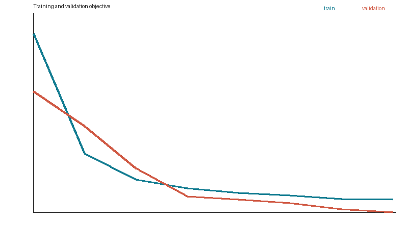
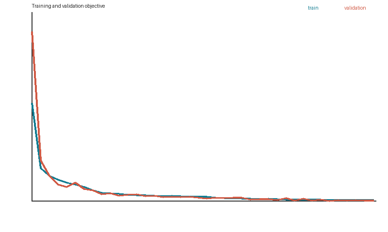

# Learning a Generative Representation of Procedural 3D Stools

## Abstract

This project studies whether a compact neural model can learn the distribution of a
procedurally generated family of multi-part 3D stools. I built an original parameterized
surface sampler, represented each object as a normalized point cloud, and compared a
PointNet-style deterministic autoencoder with a variational autoencoder. A small reproducible
experiment demonstrates reconstruction, prior sampling, interpolation, latent analysis, and
a three-seed KL-weight study. The final VAE produces recognizable stool-like point sets and
slightly outperforms the matched deterministic baseline on held-out Chamfer distance.

## Motivation

Procedural programs expose meaningful controls but require the original rules to create a new
object. Generative models instead attempt to learn the distribution from examples. Stools are
a useful test category: they share clear semantic structure, while continuous proportions and
discrete seat/support choices create visible variation and multi-part topology.

## Experimental setup

The final experiment uses 1,000 stools with 384 surface points each, an 80/10/10 split, a
24-dimensional latent code, hidden width 192, batch size 32, and 40 Adam epochs. Both models
use matched encoder/decoder capacity and the symmetric squared Chamfer objective. The VAE uses
`beta = 0.0002`, warmed up over 12 epochs. The main run uses seed 7. A separate controlled
study trains smaller matched models for 20 epochs using three seeds and three β values.

## Results

Random training examples show the intended distribution includes tall and short stools,
different seat footprints, square and round seats, varying legs, and optional supports.

The deterministic baseline obtains test Chamfer **0.0230 ± 0.0067**, compared with
**0.0223 ± 0.0059** for the VAE. At this training scale, the regularized model slightly
outperforms the AE instead of paying the reconstruction penalty observed in the original
eight-epoch prototype. Training curves remain stable. On Apple MPS, training takes 15.6
seconds for the 619,032-parameter AE and 13.2 seconds for the 628,272-parameter VAE.

Input/reconstruction pairs retain the broad seat-and-leg arrangement, although thin structures
remain challenging at only 256 output points.

Random prior samples are spatially non-collapsed: all 64 outputs have nontrivial extent along
every axis. Of these, **42.2%** satisfy a conservative structural rule requiring a wide upper
seat region, a lower supporting region, and points reaching floor height. Mean pairwise
generated Chamfer is **0.0687**, while mean nearest-training Chamfer is **0.0673**. Together,
these results show variation and argue against exact copying, although they do not prove mesh
validity. The visual results show recognizable seat-and-leg structure with occasional malformed
or incomplete supports.

Linear interpolation between two encoded test objects changes coordinates continuously and
does not exhibit abrupt cloud collapse. Traversing the most variable coordinate provides a
second controlled view of model sensitivity.

The held-out latent-to-parameter ridge probe reaches R² **0.650** for the AE and **0.643** for
the VAE, suggesting that much of the procedural variation is linearly accessible. This does
not establish independent or causal latent factors.

## KL-weight experiment

To test the role of regularization rather than choosing β arbitrarily, I trained models at
three β values across seeds 7, 17, and 29. These shorter experiments use identical model and
dataset sizes within each seed.

| β | Test Chamfer ↓ | Pairwise sample Chamfer ↑ | Nearest-training Chamfer ↓ |
|---:|---:|---:|---:|
| 0 | 0.0463 ± 0.0087 | 0.0236 | 0.1525 |
| 0.0002 | 0.0470 ± 0.0077 | 0.0343 | 0.0940 |
| 0.001 | 0.0527 ± 0.0101 | 0.0500 | 0.0565 |

Stronger KL regularization increases reconstruction error but produces more varied prior
samples that lie closer to the procedural training distribution. This supports the chosen
middle setting as a balance rather than a universally optimal value. The full raw results are
stored in `outputs/beta_ablation.json`.

## What I learned

The most important lessons were not just about making the loss decrease. Point clouds forced
me to design for permutation invariance and to use a set-aware distance instead of matching
array rows. The AE/VAE comparison clarified why good reconstruction does not automatically
make a latent space sampleable. I also learned how easily an evaluation can mislead: my first
linear probe was underdetermined and produced an artificial R² of 1.0, so I replaced it with a
held-out ridge probe. I discuss the implementation mistakes, modeling tradeoffs, and research
process in detail in [What I Learned](WHAT_I_LEARNED.md).

## Limitations

Chamfer distance can reward average-looking point sets and does not ensure part connectivity.
Fixed part sampling is not uniform over exact surface area. The structural metric is stricter
than a non-collapse check but still cannot verify exactly four legs, stable contact,
connectivity, or watertightness. The main high-resolution result uses one seed, although the
smaller β comparison uses three.

## Next experiments

The strongest follow-up is a part-aware or folding-based decoder that preserves thin legs and
connectivity better than the fully connected point decoder. A conditional VAE could receive
known procedural factors and test controllable generation. Converting point sets to meshes
would enable connected-component, stability, and watertightness measurements.

## Conclusion

The project establishes an original and reproducible procedural-to-learned 3D pipeline. It
also demonstrates a central tradeoff: KL regularization changes reconstruction quality,
sample diversity, and proximity to the procedural distribution in different directions. The
gap between recognizable point clouds and guaranteed structural correctness is the most useful
next direction.
